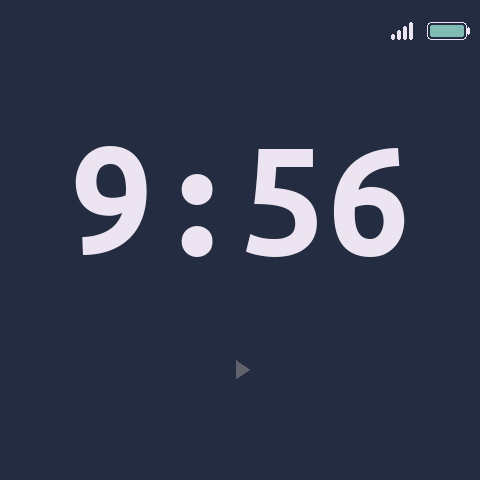
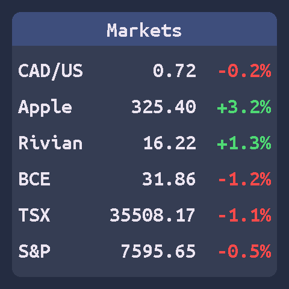
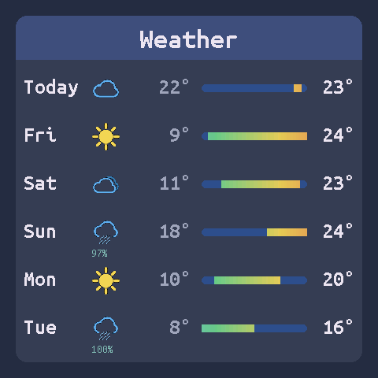
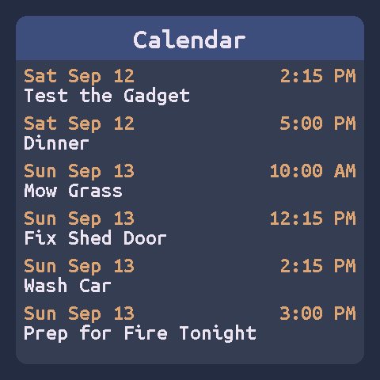
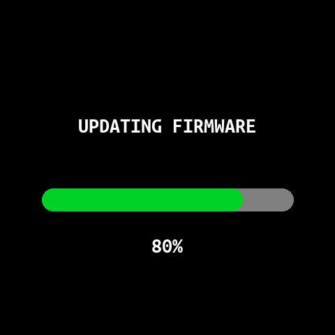

# Desktop Gadgets for SQUiXL

This is a fork of the Unexpected Maker SQUiXL project with four new full-screen widget panels:
* Clock - with WiFi and Battery Status plus a play/pause control for auto-rotation of widgets
* Markets - up to six stock/index/currency symbols from Yahoo Finance
* Weather - OpenWeather forecast
* Calendar - Next six events in your Google Calendar
* OTA progress bar - shows status during OTA firmware updates

    

# SQUiXL Official Shipping Firmware V2

This is a new firmware revision with breaking API changes from firmware version 1.  [Firmware version 1](https://github.com/UnexpectedMaker/SQUiXL-DevOS/tree/firmware_v1) is still available if you want to keep using that, but if you have forked this project and added custom functionality, please see the firmware upgrade doc in the `/docs` folder.  

Hey, congratulations, you got yourself a SQUiXL!

This repository includes the (totally in development, forever to be evolving) full source for the included shipping firmware, which requires PlatformIO.

The shipping firmware is really a development demo that is used to add and test new features, and to offer those that want to design rich interactive applications a solid starting point that touches every aspect of what you can do with SQUiXL.

Maybe one day it will turn into something more... maybe a full OS of sorts, but for now it's just a fun playground.

# You don't own a SQUiXL?
We should remedy that right away... Head over to https://squixl.io and order yourself one.

# License
All code provided here by Unecpedted Maker falls under the MIT License.

## SQUiXL GPIO Table

Below are lists of GPIO used on SQUiXL that iclude native ESP32-S3 IO, IO Expander IO and IOMUX IO.

I've also included the IO used for the ESP32-S3 RGB LCD Peripheral that drives the screen, and these IO *SHOULD NOT BE TOUCHED* or the screen will not oppperate.

| ESP32-S3 | GENERAl IO    |
| -------- | ------------- |
| IO0      | BOOT          |
| IO1      | I2C SDA       |
| IO2      | I2C SCL       |
| IO3      | Touch IC INT  |
| IO40     | Backlight PWM |
| IO41     | IOMUX 1       |
| IO42     | IOMUX 2       |
| IO43     | FG Interrupt  |
| IO44     | RTC Interrupt |
| IO45     | IOMUX 3       |
| IO46     | IOMUX 4       |

| IO Expander |           |
| ----------- | --------- |
| IO0  | Backlight Enable |
| I01  | LCD Reset        |
| IO2  | LCD Data         |
| IO3  | LCD SCK          |
| IO4  | LCD CS           |
| IO5  | Touch IC Reset   |
| IO7  | uSD Card Detect  |
| IO8  | IOMUX SEL        |
| IO9  | IOMUX Enable     |
| IO10 | Haptics Enable   |
| IO11 | VBUS Sense       |

| IOMUX | FUNC 1  | FUNC 2    |
| ----- | ------- | --------  |
| IO1   | SD MISO | I2S SD    |
| IO2   | SD CS   | I2S LRCLK |
| IO3   | SD CLK  | I2S DATA  |
| IO4   | SD MOSI | I2S BCLK  |

| RGB Peripheral |       |
| -------------- | ----- |
| ESP32-S3       | FUNC  |
| IO4            | R5    |
| IO5            | R4    |
| IO6            | R3    |
| IO7            | R2    |
| IO8            | R1    |
| IO9            | G5    |
| IO10           | G4    |
| IO11           | G3    |
| IO12           | G2    |
| IO13           | G1    |
| IO14           | G0    |
| IO15           | B5    |
| IO16           | B4    |
| IO17           | B3    |
| IO18           | B2    |
| IO21           | B1    |
| IO38           | DE    |
| IO39           | PCLK  |
| IO47           | VSYNC |
| IO48           | HSYNC |
